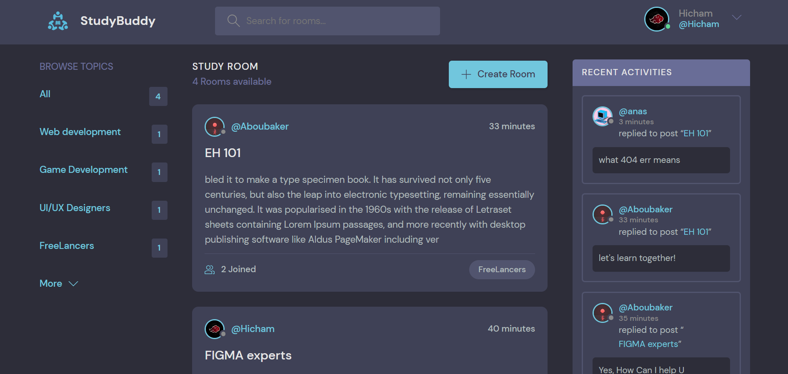

# StudyBud (Django Course)

StudyBud is an immersive Django course that focuses on the fundamental aspects of Django development. Throughout the course, I gained a deep understanding of Django's folder structure, model creation, view handling, URL routing, admin panel usage, and the magic of Modelforms. By completing this course, I developed strong proficiency in Django's backend processes and best practices, enabling me to create robust web applications efficiently.

## Screenshot

